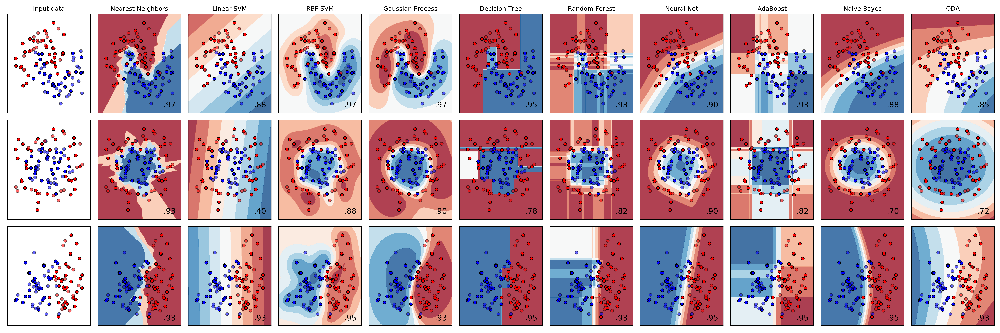
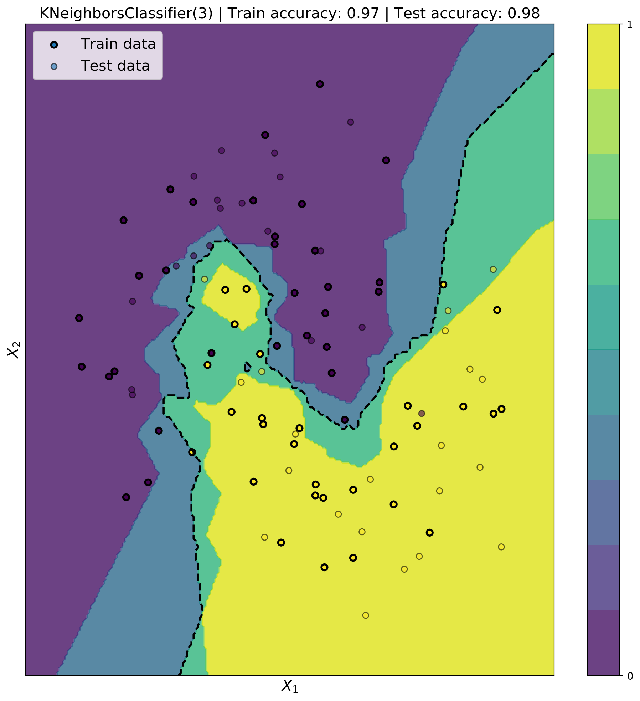

# Scikit-learn classifer visualization

Some binary classifiers are trained on a 2D dataset and visualised.


## Installation

```bash
git clone https://github.com/PierreExeter/classifier_visualizations.git
```

add conda env.

## Classifier comparison

This visualisation by Scikit Learn compares the performance of various classifier. Adapted from [here](https://scikit-learn.org/stable/auto_examples/classification/plot_classifier_comparison.html).

```bash
python 1_classifier_comparison.py
```



## K-Nearest Neighbors plot

K-Nearest Neighbors is a popular classifier. After being fitted on the train data, it can predict a probability (between 0 and 1) for each point in the 2D feature space. The decision boundary is fixed at 0.5.

```bash
python 2_simple_plot_KNN.py
```




## Effect of the number of neighbors

Changing the number of neighbors can have a significant effect on the test accuracy and may cause overfitting.

```bash
python 3_nb_neighbors_effect.py
```


The mode is overfitting for low number of neighbors as the train accuracy is marginally higher than the test accuracy (i.e. the model does not generalise to unseen data). The best number of neighbors is 14 for this particular dataset.

## Effect of the dataset size
