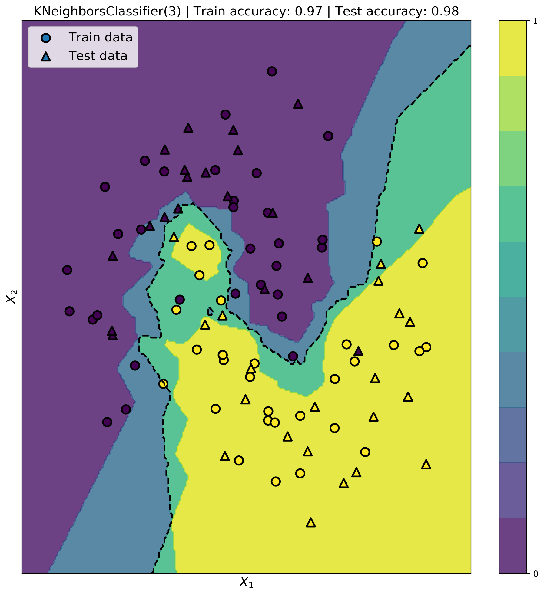
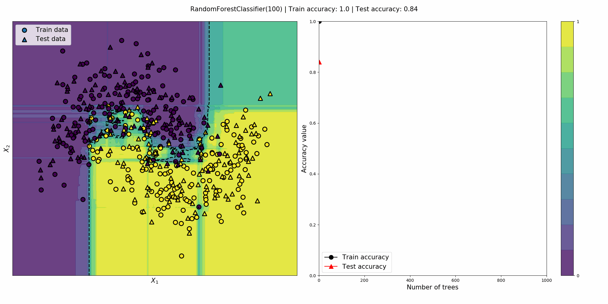

# Scikit-learn classifer visualization

Some binary classifiers are trained on a 2D dataset and visualised.


## 0. Installation

```bash
git clone https://github.com/PierreExeter/classifier_visualizations.git
```

add conda env.

## 1. Classifier comparison

This visualisation by Scikit Learn compares the performance of various classifier. Adapted from [here](https://scikit-learn.org/stable/auto_examples/classification/plot_classifier_comparison.html).

```bash
python 1_classifier_comparison.py
```


## 2. Classifier plot

K-Nearest Neighbors is a popular classifier. After being fitted on the train data, it can predict a probability (between 0 and 1) for each point in the 2D feature space. The decision boundary is fixed at 0.5.

```bash
python 2_simple_plot_KNN.py
```




## 3. Manual hyperparameter tuning

### KNN - number of neighbors

Changing the number of neighbors can have a significant effect on the test accuracy and may cause overfitting.

```bash
python 3_KNN_hyperparameter_tuning.py
```


The model is overfitting for low numbers of neighbors since the train accuracy is marginally higher than the test accuracy (i.e. the model does not generalise on unseen data). The best number of neighbors is 14 for this particular dataset.


### SVC - regularization parameter

```bash
python 3_SVC_hyperparameter_tuning.py
```


### Random Forest - nb of trees

```bash
python 3_RFC_hyperparameter_tuning.py
```


Random forest is clearly overfitting the dataset.

## Effect of the dataset size


add effect of dataset size

add ROC curve, F1 score, confusion matrix

add pipelines and cross validation and hyperparameter tuning
